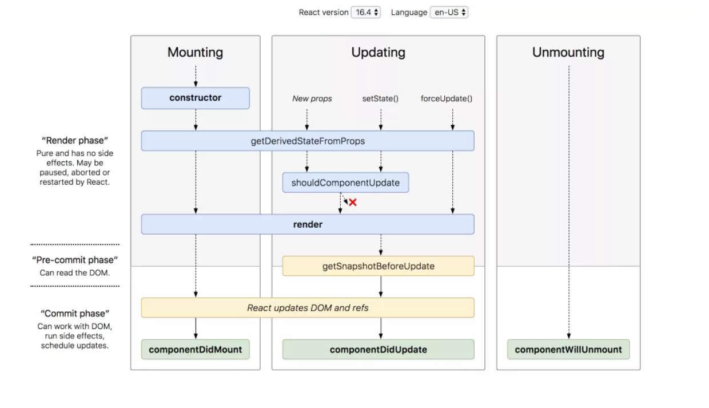

<br />

I’m on a bit of a React journey at the moment, so I’ve decided to write some blog posts about its key concepts. First on my list if the component lifecycle, because I've been using it to give my websites some life. By this I mean animating sticky headers and fetching data from a remote endpoint.


[Click to see the original!](http://projects.wojtekmaj.pl/react-lifecycle-methods-diagram/)

Just like humans, React components go through their own lifecycles. These lifecycles are composed of several different phases that can be manipulated to run code at different times in the component's existence. Each phase comes with its own lifecycle methods, which are particularly useful if you want to make something happen at a specific time in the program. I’ll mostly be using asynchronous data fetching in my examples because it’s something I had to get my head around to make my [FlickrAPI image gallery](https://izabelle-art.netlify.com/#/).

The lifecycle methods come in four main categories:

> 1. Mounting
> 1. Updating
> 1. Error boundaries
> 1. Unmounting

You could say that mounting constitutes the components birth, unmounting to its death, and everything in between as its growth.

There are lots of useful methods that come under these categories, but `render()` is the only essential one. It returns JSX rendered in the UI, or null if the component is empty. `Render()` is a pure function, which means that you can’t alter state or perform any asynchronous functions within it. This is where the other lifecycle methods come into use.

## Why not to use componentWillMount()

<br />

The first lifecycle method in a component’s mounting phase was `componentWillMount()`, which would run just before the render method. React have deprecated its use due to it often being used incorrectly.
Based on my research, `ComponentWillMount()` was frequently used for data fetching. You might think that it makes sense to initiate a data request before the render, to give the fetch request a head start, before the UI is rendered.

In reality, this isn't a good idea. The data will usually take a while to return, by this time render will already have taken place. This said, if the request was resolved and the data came back before the render, you would be trying to set state on an unmounted component. Best practice is to render the HTML before sending a data request, as this allows the skeleton UI to load and provide a loading indicator to show the user that the page is on its way. Similarly, if you have an app with data that changes every few seconds, you don’t want a change in the data to cause a re-render every time it updates.

## Using componentDidMount() for Async Functions

<br />

`ComponentDidMount()` is considered the best location for initiating an asynchronous function, as it runs just after the initial render. Here’s a basic example of how you could fetch data in a class component:

<br />

```javascript

state = { data: undefined };

componentDidMount() {
fetch('https://example.api.com')
.then(response => response.JSON())
.then(data => this.setState({data})
}

```

<br />

> First we set the state and decide which lifecycle method to use, call the fetch function with our API address, convert the data response into JSON and set our data to the newly received response.

## React Hooks for Data Fetching

<br />
With the release of React 16.8, side-effects such as data fetching don’t need to be placed under lifecycle methods in class components. React Hooks were introduced to allow developers to tap into the React state and lifecycle features without using class components. Hooks provide a more concise means of setting state and side-effects.

The `useEffect()` hook can be used in an equivalent way to `componentDidMount()`, `componentDidUpdate()` and `componentWillUnmount()`. In other words, it handles side effect functions. Here’s is the same example of data fetching shown in the last example, but using the `useEffect()` hook:

```javascript
const [data, setData] = useState(undefined)

useEffect(() =>
  fetch('https://example.api.com')
    .then(response => response.JSON())
    .then(data => this.setState({data});
), []);
```

<br />

We just want `useEfecct()` to run and clean up once, so a dependency array can be passed in as the second argument. This array can either be empty, or it can contain parameters (state and props) that control when the `useEffect()` is run. If the array is left empty, then it will only run once on mounting. If you include dependency parameters, the `useEffect()` hook will run each time one of these parameters is changed or updated. Without the dependency conditions, it can be triggered by any change to the component’s data, which can be quite often if you have a complex app with lots of props.

## Don't forget to Unmount

<br />

The useEffect hook also offers an optional clean-up function called `componentWillUnmount()`, which runs just before the component unmounts. You can use this method to unsubscribe from any side effects or async functions initiated in `componentDidMount()`. Leaving active subscriptions results in a memory leak warning, so it’s important to use this function to destroy anything that might continue running after the component has left the DOM.

To illustrate, here’s an example of a function that gets called every time the user scrolls. The `useEffect()` still only mounts and unmounts once, so our cleanup function removeEventListener cancels the event subscription when the component unmounts.

```javascript
useEffect(() => {
    const handleScroll = () => {
        console.log("page was scrolled";
    };
    window.addEventListener("scroll)handleScroll);
    return () => {
        window.removeEventListener("scroll", handleScroll);
    }
}, []);
```

Find out more from the [React official docs.](https://reactjs.org/docs/react-component.html)
