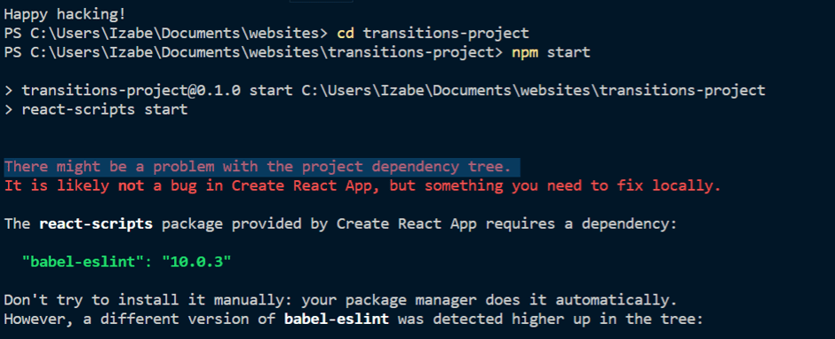

When you clone Create React App and run `npm start`, this error may appear:

> There might be a problem with the project dependency tree. It is likely not a bug in Create React App, but something you need to fix locally.

**What does it mean?**

As the error suggests, there&#39;s a problem with the project dependency tree. A problem that appears to crop up regularly within the NPM ecosystem. Ultimately, versions of certain packages can depend on specific versions of other packages. When there&#39;s a conflict in these version dependencies, your React App will face an error.

**How do we fix it?**

In this case, the error was caused by an old version of _babel-eslint_ in a misplaced node_modules package. While the new React App was stored in \Documents\websites\transitions-project, an old NPM package lay dormant in \Documents.

You can `cd ../` into the directory above and ls to list the files, if you see an incorrectly placed _node_modules_ folder, delete it. After you&#39;ve located and removed the problematic file, return to your project, delete node-modules, run `npm install` and try `npm start` again.
