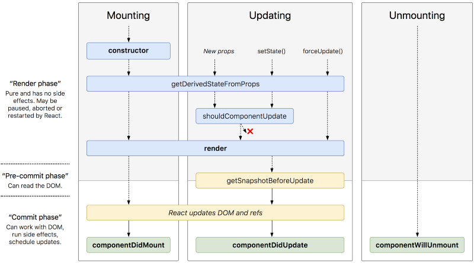

<br />

I’m on a bit of a React journey at the moment, so I’ve decided to write some blog posts about its key concepts. First on my list is the component lifecycle, which I've recently had to get my teeth stuck into!

This article gives a brief explanation of the most useful Lifecycle methods before showing how to use React hooks to tap into these lifecycle methods in a function component.


[Click to see the original!](http://projects.wojtekmaj.pl/react-lifecycle-methods-diagram/)

## **What is the React component Lifecycle?**

<br />

Just like humans, React components go through their own lifecycles. These lifecycles are composed of several different phases that can be manipulated to run code at different times in the component's existence. Each phase comes with its own lifecycle methods, which are used to run code at specific times in the program.

<br />

**The lifecycle methods come in four main categories:**

> 1. Mounting
> 1. Updating
> 1. Error boundaries
> 1. Unmounting

<br />

You could say that mounting constitutes the components birth, unmounting to its death, and everything in between as its growth. First, the component is created and mounted to the DOM. Once in place it can undergo updates triggered by changes to `state` and `props`, before unmounting itself from the DOM.

## **Constructor()**

<br />

The `constructor()` is the first method invoked during the component lifecycle. It's automatically called to **initialise state** and bind any **event handlers** in a class component. A quick example:

```javascript
class ExampleComponent extends React.Component {
  constructor(props) {
    super(props)
    this.state = {
      name: "John",
    }
    this.changeName = this.changeName.bind(this)
  }
}
```

<br />

The constructor is **NOT** the place to introduce any side effects. Same goes for `Render()` which is a pure function, meaning that you can’t alter state or perform any asynchronous functions within it. This is where the other lifecycle methods come in handy.

## **ComponentWillMount()**

<br />

`ComponentWillMount()`, which was called before the `render()` has now been **deprecated by React**. It was sometimes used to initiate an AJAX request, but it's generally a bad idea to initiate a data request before the UI has loaded.

Best practice is to render the HTML before sending a data request, as it allows the skeleton UI to load and provide a loading indicator to show the user that the page is on its way. Similarly, if you have an app with data that changes every few seconds, you don’t want a change in the data to cause a re-render every time it updates.

## **ComponentDidMount()**

<br />

The next lifecycle method is `componentDidMount()`, which runs immediately after the `render()` is complete and the component has mounted to the DOM. It is the best location for initiating an asynchronous function. Here’s a basic example of how you could fetch data in a class component:

<br />

```javascript

state = { data: undefined };

componentDidMount() {
fetch('https://example.api.com')
.then(response => response.JSON())
.then(data => this.setState({data})
}

```

<br />

> First we set the state and decide which lifecycle method to use, call the fetch function with our API address, convert the data response into JSON and set our data to the newly received response.

## **Data Fetching with React Hooks**

<br />

With the release of React 16.8, side-effects such as data fetching don’t have to be placed under lifecycle methods in a 'stateful' class component. React Hooks were introduced to allow developers to tap into the React state and lifecycle features without using class components. Hooks provide a more concise means of setting state and side-effects in a function component.

The `useEffect()` hook can be used in an equivalent way to `componentDidMount()`, `componentDidUpdate()` and `componentWillUnmount()`. In other words, it handles side effect functions. Here’s the example above refactored to React Hooks:

```javascript
const [data, setData] = useState(undefined)

useEffect(() =>
  fetch('https://example.api.com')
    .then(response => response.JSON())
    .then(data => this.setState({data});
), []);
```

<br />

We just want `useEffect()` to run and clean up once, so a dependency array can be passed in as the second argument. This array can either be empty, or it can contain parameters (state and props) that control when the `useEffect()` is run. If the array is left empty, then it'll only run once on mounting. If you include dependency parameters, the `useEffect()` hook will run each time one of these parameters is changed or updated. Without the dependency conditions, it can be triggered by any change to the component’s data, which can be quite often if you have a complex app with lots of props.

## **ComponentDidUpdate()**

If you've got state based on props you might need to use the `componentDidUpdate()` method, which is invoked straight after an update has occurred. Use it to update the DOM by comparing the previous props to the current props, see the example below:

```javascript
componentDidUpdate(prevProps) {
  if (this.props.userName !== prevProps.useName) {
    this.fetchDada(this.props.userName);
  }
}

```

## **Don't forget to Unmount**

<br />

The `useEffect()` hook also offers an optional clean-up function called `componentWillUnmount()`, which runs just before the component unmounts. You can use this method to unsubscribe from any side effects or async functions initiated in `componentDidMount()`. Leaving active subscriptions results in a memory leak warning, so it’s important to use this function to destroy anything that might continue running after the component has left the DOM.

Here's an example of a function that gets called every time the user scrolls. `UseEffect()` still only mounts and unmounts once, so our clean up function `removeEventListener` cancels the event subscription when the component unmounts.

```javascript
useEffect(() => {
    const handleScroll = () => {
        console.log("page was scrolled";
    };
    window.addEventListener("scroll", handleScroll);
    return () => {
        window.removeEventListener("scroll", handleScroll);
    }
}, []);
```

## **Error Boundaries**

<br />

Error boundaries are a bit different as they can only be used in class components and can't be used with Hooks. Error boundaries are class components that use either (or both of) `static getDerivedStateFromError()` or `componentDidCatch()` to catch errors in their child component tree. They catch errors, log the error, and provide a fallback UI (for example a retry button) instead of breaking the whole app:

```javascript
class ErrorBoundary extends React.Component {
  constructor(props) {
    super(props)
    this.state = { error: null }
  }

  componentDidCatch(error) {
    this.setState({
      error,
    })
  }

  render() {
    if (this.state.error) {
      // You can render any custom fallback UI
      return <h1>Something went wrong.</h1>
    }

    return this.props.children
  }
}
```

Once defined, they can be used as a regular component:

```javascript
<ErrorBoundary>
  <ChildComponent>
</ErrorBoundary>
```

<br />

For a more in depth guide to all the lifecycle methods check out the [React official docs.](https://reactjs.org/docs/react-component.html)
